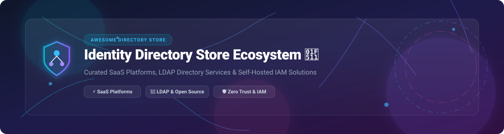

  

  
  
  
  
  
  

# ⚡ Awesome In-Memory Caching (Redis / Memcached / Valkey) Ecosystem 🚀

> **A curated, SEO-optimized directory of SaaS managed caching platforms, Redis OSS alternatives, high-performance in-memory databases, and distributed key-value data stores.** 💡

---

## 📌 Executive Summary & Key Highlights 🔍

This repository tracks notable **commercial managed caching platforms** and **open-source GitHub projects** that provide in-memory caching, sub-millisecond key-value storage, and real-time data persistence — from hyper-scale cloud managed services to community-governed Redis successors and multi-threaded engine alternatives. 🌐

* **⚡ SaaS Industry Leaders**: Amazon ElastiCache, Redis Enterprise Cloud, Upstash Redis, Azure Cache for Redis, Google Cloud Memorystore, Momento Serverless Cache, Dragonfly Cloud, Hazelcast Cloud, and Aiven.
* **🔓 Open-Source Breakthroughs**: The Redis ecosystem underwent a historic licensing shift in 2024–2025, establishing **Valkey** (Linux Foundation BSD-3-Clause) backed by AWS, Google, and Oracle. **Dragonfly** delivers 2.5–3.5x throughput under high concurrency. **Garnet** (Microsoft Research) brings native .NET performance, while **KeyDB**, **DiceDB**, **Memcached**, **Caffeine**, **Apache Ignite**, and **SugarDB** provide high-speed caching across Go, Java, Python, Node.js, and C++.

---

## 🗂️ Table of Contents 📋

- [☁️ SaaS/Hosted Platforms](#️-saashosted-platforms-)
- [🔓 Open-Source GitHub Projects](#-open-source-github-projects-)
  - [⚡ Redis-Compatible & High-Performance Caches](#-redis-compatible--high-performance-caches)
  - [⚡ Memcached, Proxies & Protocol Routers](#-memcached-proxies--protocol-routers)
  - [⚡ Embedded & Application-Level Cache Libraries](#-embedded--application-level-cache-libraries)
  - [⚡ Distributed Data Grids & In-Memory Computing](#-distributed-data-grids--in-memory-computing)
- [🛠️ Frameworks & Decision Architecture](#️-frameworks--decision-architecture-)
- [🤝 How to Contribute](#-how-to-contribute-)
- [☕ Support & Sponsorship](#-support--sponsorship-)
- [⭐ Star History](#-star-history-)
- [⚠️ Disclaimer](#️-disclaimer-)

---

## ☁️ SaaS/Hosted Platforms 🌐

> 📊 **Sector Market Size & Dynamics**: The global in-memory database and data caching market is valued at **~$10.4B – $17.5B (2025/2026)** and is tracking at an 11.2% CAGR. The market structure is **moderately fragmented**: hyper-scale cloud providers (AWS, Microsoft Azure, Google Cloud) hold heavy market concentration for integrated infrastructure, while specialized vendors (Redis Ltd., Upstash, Momento, Dragonfly Cloud, Hazelcast) thrive by capturing developer-first serverless and extreme performance niches.

| Platform | Description | Pricing (Starting Tier) | Free Tier / Trial Limits | Company Scale (Valuation / Revenue) |
| :--- | :--- | :--- | :--- | :--- |
| **[Google Cloud Memorystore](https://cloud.google.com/memorystore)** ☁️ | **Google's managed caching** — supports Redis, Memcached, and Valkey. Best for GCP-native caching. | ~$0.049 / GiB-hour (Basic Tier) | No permanent free tier ($300 GCP new account trial credit) | **$4.25 Trillion** (Alphabet Market Cap) |
| **[Azure Cache for Redis](https://azure.microsoft.com/en-us/products/cache/)** 💻 | **Microsoft's managed Redis** — integrated with Azure ecosystem. Note migration timeline to Azure Managed Redis. | ~$0.022 / hour (Basic C0, 250 MB) | No permanent free tier ($200 Azure new account trial credit) | **$3.93 Trillion** (Microsoft Market Cap) |
| **[Amazon ElastiCache](https://aws.amazon.com/elasticache/)** 📦 | **AWS's fully managed caching service** — supports Redis, Memcached, and Valkey. Serverless & node options. | $0.084 / GB-hour (Valkey Serverless) or ~$0.017 / hour (t4g.micro) | 750 hrs/month `cache.t3.micro` for 12 months (or $100 credits for new accounts) | **$2.75 Trillion** (Amazon Market Cap / $169B AWS Annual Revenue) |
| **[Redis Enterprise Cloud](https://redis.com/cloud/)** 🔴 | **The commercial Redis platform** — fully managed with active-active geo-distribution and modules. | $5.00 / month (Essentials, 250 MB) | Permanent Free Tier (30 MB database, 30 connections, 100 ops/sec) | **~$2.0 Billion** (Private Valuation) |
| **[Hazelcast Cloud](https://hazelcast.com/)** ⚡ | **In-memory data grid** — distributed caching and stream processing at scale. | Metered consumption / Custom quote | 14-day Free Trial (Cloud Standard, 0.5 GiB memory limit, single node) | **~$100M - $250M** (Estimated Valuation / $63.6M Raised) |
| **[Momento Serverless Cache](https://www.gomomento.com/)** 🚀 | **Serverless caching platform** — pay-per-use with sub-millisecond latency. | ~$0.018 / GiB-hour (Valkey physical storage) | Permanent Free Tier (5 GB monthly data transfer included) | **~$50M - $100M** (Estimated Valuation) |
| **[Dragonfly Cloud](https://www.dragonflydb.io/)** 🐉 | **Managed Dragonfly** — multi-threaded architecture for high throughput & memory efficiency. | ~$8.00 / GB memory per month | No permanent free tier (Free trial available upon request) | **~$50M - $100M** (Estimated Valuation / $21M Raised) |
| **[Upstash Redis](https://upstash.com/redis)** ⚡ | **Serverless Redis** — pay-per-request pricing with REST API and global replication. | $0.20 per 100K commands ($0.25/GB storage) | Permanent Free Tier (500K commands/month, 256 MB storage, 10 GB bandwidth) | **~$20M - $50M** (Estimated Valuation / $11.9M Raised) |
| **[Aiven for Redis](https://aiven.io/redis)** 🦀 | **Managed caching on multiple clouds** — available on AWS, GCP, Azure, and DigitalOcean. | $12.00 / month (Hobbyist Plan) | Permanent Free Plan (1 VM, 1 CPU, 1 GB RAM, 1 GB Storage) | **Private startup** ($210M+ total funding raised for Aiven) |
| **[Memurai](https://www.memurai.com/)** 🪟 | **Redis-compatible cache for Windows** — native Windows service for Windows-centric environments. | Custom quote for Enterprise Edition | Developer Edition Free for dev/test (10-day max continuous uptime limit per launch) | **Private boutique / Niche** |

---

## 🔓 Open-Source GitHub Projects 🛠️

*The open-source projects below are sorted by GitHub Stars_Counts (descending).*

### ⚡ Redis-Compatible & High-Performance Caches

- **[Redis 8](https://github.com/redis/redis)**  🔴  
  **Redis under dual/AGPLv3 licensing**, integrating Redis Stack modules directly into core. Features up to 87% faster commands, 2x throughput, JSON, Time Series, and Search Query Engine.

- **[Dragonfly](https://github.com/dragonflydb/dragonfly)**  🐉  
  **Modern ultra-fast in-memory data store**, BSL 1.1 licensed. Multi-threaded, shared-nothing architecture delivering 2.5–3.5x throughput of original Redis while using 15–22% less RAM.

- **[Valkey](https://github.com/valkey-io/valkey)**  🛡️  
  **The primary open-source BSD-3-Clause successor to Redis**, Linux Foundation project backed by AWS, Google, and Oracle. Fully retains Redis data structures, Sentinel, clustering, and Lua scripts with multithreaded I/O.

- **[KeyDB](https://github.com/Snapchat/KeyDB)**  🔑  
  **Multi-threaded Redis fork from Snapchat**, BSD-3-Clause licensed. Features active-active multi-master replication, multi-threaded query execution, and FLASH storage overflow.

- **[Garnet](https://github.com/microsoft/garnet)**  💎  
  **Microsoft Research's Redis-compatible cache store**, MIT licensed. Built on modern .NET with native multithreading, async network I/O, and lock-free data structures.

- **[DiceDB](https://github.com/DiceDB/dice)**  🎲  
  **In-memory real-time database with SQL-based reactivity**, fork of Valkey. Drop-in Redis replacement with `dicedb-spill` module for RocksDB disk persistence on eviction.

- **[Redka](https://github.com/nalgeon/redka)**  🗃️  
  **Redis re-implemented with SQLite**, BSD-3-Clause licensed. Provides Redis API compatibility backed by ACID-compliant SQLite storage.

---

### ⚡ Memcached, Proxies & Protocol Routers

- **[Memcached](https://github.com/memcached/memcached)**  ⚡  
  **The classic distributed memory object caching system**, BSD-3-Clause licensed. Simple, multi-threaded, high-speed key-value caching standard for web applications.

- **[twemproxy (nutcracker)](https://github.com/twitter/twemproxy)**  🐦  
  **Twitter's fast, lightweight proxy for Memcached and Redis**, Apache-2.0 licensed. Provides high-performance connection pooling, sharding, and key distribution.

- **[Mcrouter](https://github.com/facebook/mcrouter)**  👤  
  **Facebook's Memcached protocol router**, MIT licensed. Scales hyper-scale Memcached deployments with consistent hashing, multi-cluster routing, and failover.

---

### ⚡ Embedded & Application-Level Cache Libraries

- **[Caffeine](https://github.com/ben-manes/caffeine)**  ☕  
  **High-performance in-memory caching library for Java**, Apache-2.0 licensed. Near-optimal hit rates using Window TinyLFU eviction algorithm.

- **[BuntDB](https://github.com/tidwall/buntdb)**  🎯  
  **Embeddable in-memory key/value database for Go**, MIT licensed. Supports spatial R-Tree indexing, custom sorting, and JSON indexing.

- **[Ristretto](https://github.com/dgraph-io/ristretto)**  🍃  
  **High-performance memory cache library for Go**, Apache-2.0 licensed. Focused on throughput, contention resistance, and TinyLFU eviction.

- **[SugarDB (formerly EchoVault)](https://github.com/EchoVault/SugarDB)**  🍬  
  **Embeddable and distributed in-memory alternative to Redis**, Apache-2.0 licensed. Go-native with LFU/LRU eviction, Pub/Sub, and Raft clustering.

---

### ⚡ Distributed Data Grids & In-Memory Computing

- **[Hazelcast](https://github.com/hazelcast/hazelcast)**  🌰  
  **Unified real-time data platform and distributed cache**, Apache-2.0 licensed. Combines distributed in-memory storage with real-time stream processing.

- **[Apache Ignite](https://github.com/apache/ignite)**  🔥  
  **Distributed in-memory database, caching, and computing platform**, Apache-2.0 licensed. Supports ACID transactions, ANSI SQL, and compute grid processing.

---

## 🛠️ Frameworks & Decision Architecture 💡

When selecting an in-memory cache architecture for your platform:

1. **Permissive Open-Source Sovereign**: Choose **[Valkey](https://github.com/valkey-io/valkey)** for 100% Redis command compatibility under BSD-3-Clause licensing.
2. **Extreme Multi-Core Vertical Scaling**: Deploy **[Dragonfly](https://github.com/dragonflydb/dragonfly)** for multi-threaded performance and reduced RAM overhead under heavy concurrency.
3. **Active-Active Multi-Region Replication**: Deploy **[KeyDB](https://github.com/Snapchat/KeyDB)** for multi-master active-active replication across data centers.
4. **.NET Ecosystem Integration**: Utilize **[Garnet](https://github.com/microsoft/garnet)** for .NET-native async performance and lock-free memory utilization.
5. **In-App Local Caching**: Use **[Caffeine](https://github.com/ben-manes/caffeine)** for Java or **[Ristretto](https://github.com/dgraph-io/ristretto)** / **[BuntDB](https://github.com/tidwall/buntdb)** for Go applications.
6. **Managed Cloud Infrastructure**: Leverage **Amazon ElastiCache**, **Redis Enterprise Cloud**, **Google Memorystore**, or **Upstash Redis** for automated scaling, backup, and SLA coverage.

---

## 🤝 How to Contribute 📝

Contributions are welcome! Help us maintain the definitive in-memory caching directory:

1. 🍴 **Fork** this repository.
2. ➕ **Add/Edit** entries in `README.md` following the table or list format.
3. 🔗 Ensure all links target official sites or stargazers pages.
4. 🚀 **Submit a Pull Request** with a brief rationale.

---

## ☕ Support & Sponsorship 💖

If you found this ecosystem guide helpful, please consider supporting the project! Your star or sponsorship keeps open-source research independent and up to date.

* ⭐ **Star & Share**: Give this repo a star on GitHub and share it with software engineers & platform architects!
* 💬 **Join the Community**: Chat with developers on our [Discord Server](https://discord.gg/jc4xtF58Ve).
* ☕ **Buy Me a Coffee**: Sponsor the maintainer via the [GitHub Sponsor Dashboard](https://github.com/sponsors/ishandutta2007).

---

## 📊 Star History 📈

---

## ⚠️ Disclaimer 📜

- This repository is a **community-curated list** for informational and educational purposes.
- In-memory data structures store mission-critical application state; ensure proper access controls, TLS encryption, and backup configurations prior to production deployment.
- Licensing status summary: Valkey (BSD-3-Clause), Redis 8 (AGPLv3/SSPLv1), Dragonfly (BSL 1.1), KeyDB (BSD-3-Clause), Garnet (MIT), Caffeine (Apache-2.0), Memcached (BSD-3-Clause). Always verify current license agreements with your compliance team.

---

  <b>Made with ❤️ for platform engineers, backend developers, and software architects worldwide.</b>

